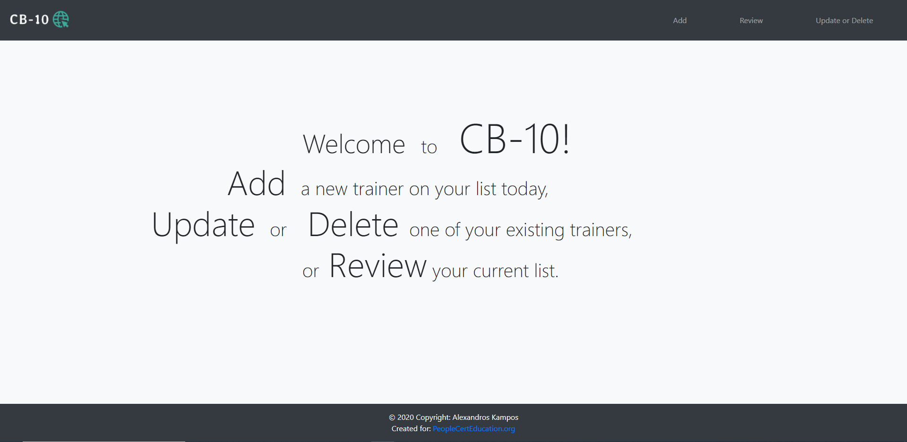
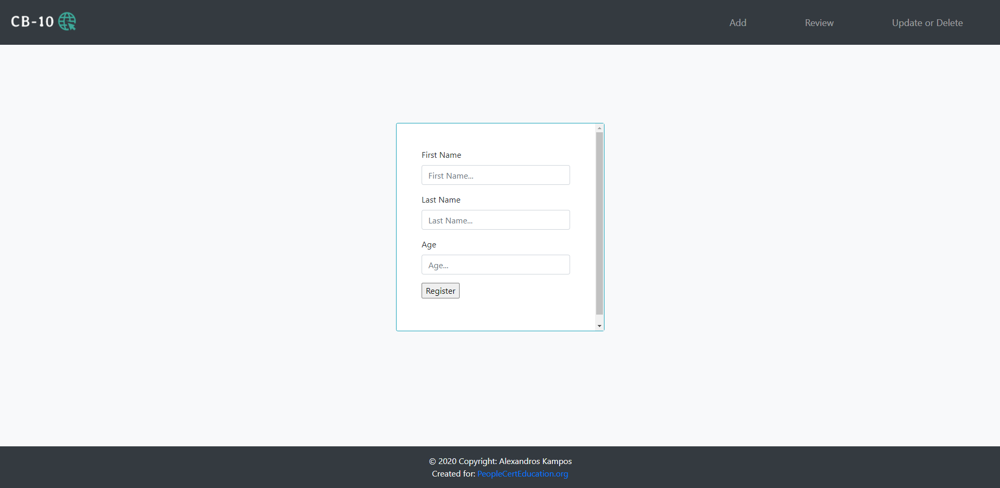
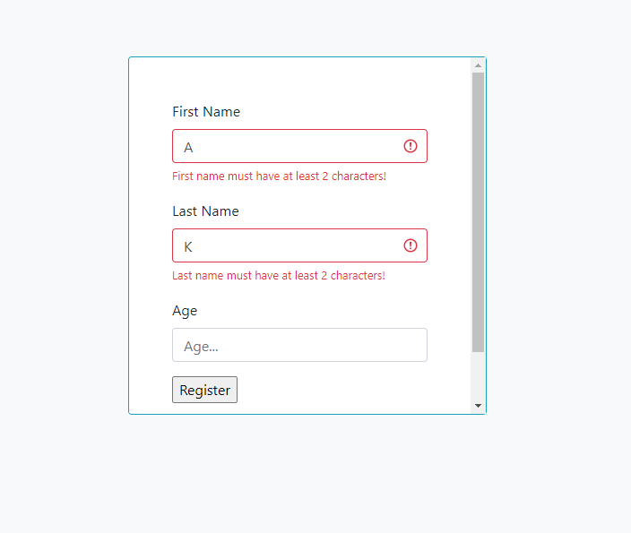
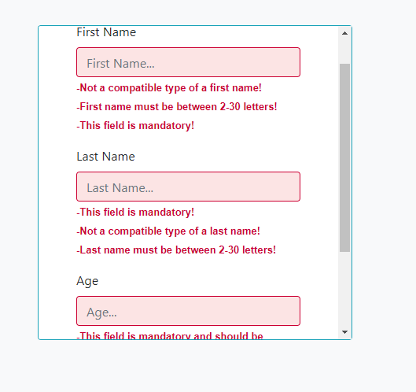
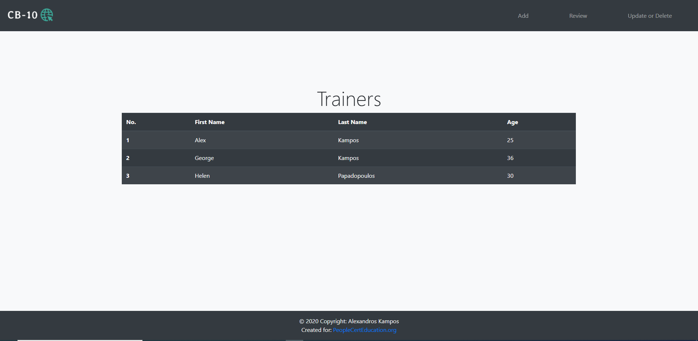
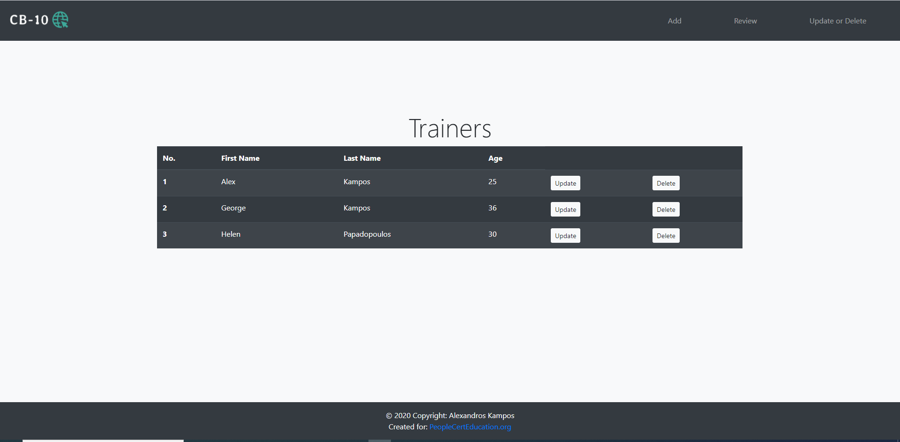
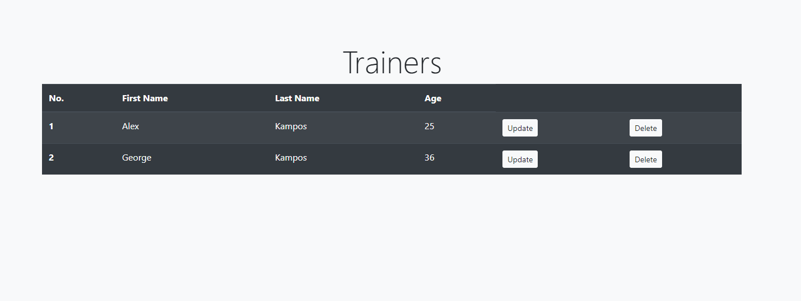
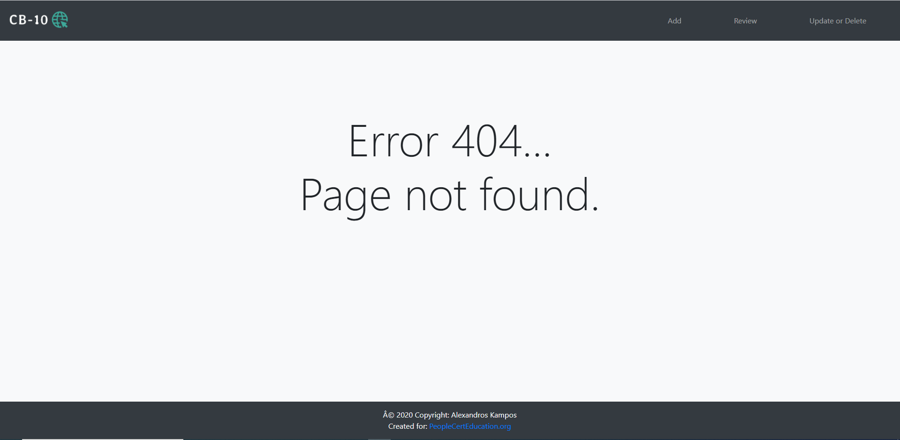
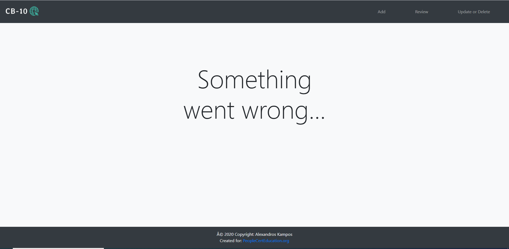

## Name

Trainer CRUD

## Description

School system's Trainer CRUD operations implemented like:\
\
&emsp;&#8226;&emsp;Create Trainer\
\
&emsp;&#8226;&emsp;Read Trainer details\
\
&emsp;&#8226;&emsp;Update Trainer details\
\
&emsp;&#8226;&emsp;Delete Trainer

## Demonstration

***First of all you need to provide a database username and password on <ins>src/main/resources/application.properties</ins> file***

Starting the web application user is redirected to the home page of the application.

#### Create trainer

Clicking on Add option on navigation bar user is able of creating a new user.

The form presented to user is provided with both front end validations

and (in case something goes wrong with front end) server validations. User gets redirected to Trainers table to see the new Trainer persisted.

#### Read Trainer details

On Review option user can view all trainers stored in database.

#### Update Trainer details or Delete Trainer

Update or Delete option gives user the capability to update trainer details by clicking the Update button,

*Same form validation rules apply as Create Trainer form*

or delete user by clicking the Delete button. On both cases user gets redirected to Trainers table to see update or delete operations are persisted.

*In the example below is presented the table afte deleting Trainer number 3*

#### Error pages

If user sends a http request on the application that creates an error or an exception he/she will be redirected to the respective page that displays the respective message.  

##### Sending a http request on a resource that doesn't exist 

##### Create a new Trainer that has the same details as an already persisted Trainer

##### Any other http request resulting to an error or exception

## Technology & Tools

<a href="https://www.java.com/en/download/">Java 8</a>  
<a href="https://netbeans.org/">Apache NetBeans IDE</a>  
<a href="https://maven.apache.org/">Maven</a>  
<a href="https://spring.io/projects/spring-boot">Spring Boot</a>  
&emsp;&#8226;&emsp;Spring Boot DevTools\
&emsp;&#8226;&emsp;Spring Web MVC\
&emsp;&#8226;&emsp;Spring Data JPA\
<a href="http://tomcat.apache.org/">Tomcat</a>  
<a href="https://www.oracle.com/java/technologies/jspt.html">JavaServer Pages</a>  
